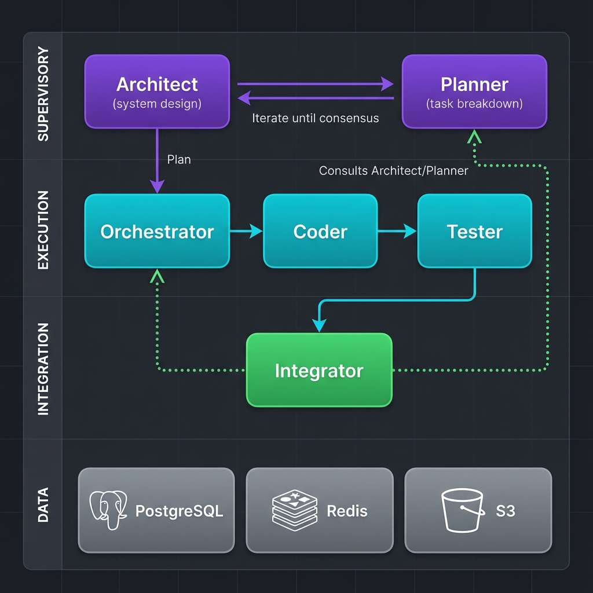

# Fullstack AI Workflow System

> Multi-Agent AI Orchestration Platform for Code Generation & Review

A production-ready platform for orchestrating AI agents to generate, review, and refine code through a structured workflow pipeline.

## Architecture Overview



```
┌─────────────────────────────────────────────────────────────────┐
│                         Frontend (React)                         │
│                    Real-time Dashboard + Terminal                │
└─────────────────────────┬───────────────────────────────────────┘
                          │ REST / SSE / WebSocket
┌─────────────────────────▼───────────────────────────────────────┐
│                      API Gateway (Go)                            │
│     High-performance routing • JWT Auth • Rate Limiting          │
└─────────────────────────┬───────────────────────────────────────┘
                          │ HTTP
┌─────────────────────────▼───────────────────────────────────────┐
│                     Worker Service (Python)                     │
│                                                                 │
│  SUPERVISORY   ┌──────────┐     ┌──────────┐                    │
│  LAYER         │ Architect│ ⟷  │ Planner  │   iterate until   │
│                └────┬─────┘     └────┬─────┘   consensus        │
│                     │                │                          │
│  EXECUTION    ┌─────▼────┐  ┌───────▼──┐  ┌──────────┐          │
│  LAYER        │Orchestrat│─▶│  Coder   │─▶│  Tester  │          │
│               └──────────┘  └──────────┘  └────┬─────┘          │
│                                                │                │
│  INTEGRATION  ┌────────────────────────────────▼──────────────┐ │
│  LAYER        │             Integrator                        │ │
│               │    (consults Architect/Planner for merges)    │ │
│               └───────────────────────────────────────────────┘ │
└─────────────────────────┬───────────────────────────────────────┘
                          │
┌─────────────────────────▼───────────────────────────────────────┐
│                     Data Layer                                   │
│     PostgreSQL (state) • Redis (cache) • S3 (artifacts)         │
└─────────────────────────────────────────────────────────────────┘
```

## Key Features

### Hierarchical Multi-Agent Pipeline
- **Architect Agent**: High-level system design and technology decisions
- **Planner Agent**: Task breakdown and dependency ordering (iterates with Architect)
- **Orchestrator Agent**: Coordinates execution agents per task
- **Coder Agent**: Generates implementation based on approved specs
- **Tester Agent**: Reviews code quality, security, and test coverage
- **Integrator Agent**: Implements merges, consults supervisory agents

### Multi-Cloud LLM Integration
Unified provider abstraction supporting:
| Provider | Models | Auth Method |
|----------|--------|-------------|
| OpenRouter | GPT-5.2, Claude 4.5, Llama | API Key |
| Google Vertex AI | Gemini 3 Pro | Service Account |
| Amazon Bedrock | Claude, Titan | IAM Role |
| Microsoft Azure | GPT | API Key + Endpoint |

### Real-Time Communication
- **SSE (Server-Sent Events)**: Live workflow progress updates
- **WebSocket Terminal**: Interactive PTY shell access
- **Event-Driven Architecture**: Pub/sub for agent coordination

### Security & Performance
- **JWT Authentication** with refresh token rotation
- **OAuth 2.0** with Google and GitHub providers
- **Multi-Factor Authentication** (TOTP) with backup codes
- **Session Management** via Redis with device tracking
- Rate limiting with sliding window algorithm
- Connection pooling for database efficiency
- Graceful shutdown with request draining

## Tech Stack

| Layer | Technology | Rationale |
|-------|------------|-----------|
| Gateway | Go + Chi | Low latency, minimal memory footprint |
| Workers | Python + FastAPI | CrewAI ecosystem, async support |
| Database | PostgreSQL | ACID compliance, JSON support |
| Cache | Redis | Session storage, rate limiting |
| Frontend | React + TypeScript | Type safety, component reuse |

## Project Structure

```
apps/
├── gateway/                 # Go API Gateway
│   ├── cmd/server/          # Entry point
│   └── internal/
│       ├── auth/            # JWT middleware
│       ├── handlers/        # HTTP handlers
│       └── middleware/      # Rate limit, logging
│
├── api/                     # Python Worker Service
│   ├── app/
│   │   ├── agents/          # CrewAI agent definitions
│   │   ├── workflows/       # Pipeline orchestration
│   │   ├── routers/         # FastAPI endpoints
│   │   └── llm_providers.py # Multi-cloud abstraction
│   └── alembic/             # Database migrations
│
└── console/                 # React Frontend
    └── app/
        ├── terminal/        # WebSocket terminal
        └── components/      # Reusable UI components
```

## Quick Start

### Prerequisites
- Go 1.22+
- Python 3.11+
- PostgreSQL 15+
- Node.js 20+

### Development

```bash
# Start database
cd apps/api && docker compose up -d db

# Run migrations
source .venv/bin/activate && alembic upgrade head

# Start Go gateway (port 8001)
cd apps/gateway && go run ./cmd/server

# Start Python workers (port 8002)
cd apps/api && uvicorn app.main:app --port 8002

# Start frontend (port 3000)
cd apps/console && npm run dev
```

## API Reference

### Authentication
```bash
# Register
curl -X POST http://localhost:8001/auth/register \
  -H "Content-Type: application/json" \
  -d '{"username":"demo","email":"demo@example.com","password":"password123"}'

# Login
curl -X POST http://localhost:8001/auth/login \
  -H "Content-Type: application/json" \
  -d '{"email":"demo@example.com","password":"password123"}'
```

### Workflow
```bash
# Create project
curl -X POST http://localhost:8001/projects \
  -H "Authorization: Bearer $TOKEN" \
  -d '{"name":"My App","description":"AI-generated application"}'

# Start generation
curl -X POST http://localhost:8001/projects/$ID/generate \
  -H "Authorization: Bearer $TOKEN" \
  -d '{"prompt":"Create a REST API for a todo application"}'
```

## Design Decisions

### Why Go + Python Hybrid?

| Challenge | Solution |
|-----------|----------|
| CrewAI is Python-only | Keep agents in Python |
| API latency requirements | Go gateway for routing |
| Memory efficiency | Go uses ~10MB vs Python ~100MB |
| Development velocity | Python for rapid AI iteration |

### Why Multi-Cloud LLM?

- **Vendor Independence**: Avoid lock-in to single provider
- **Cost Optimization**: Route to cheapest provider per use case
- **Reliability**: Failover between providers
- **Compliance**: Use regional providers for data residency

## Monitoring

```bash
# Health check
curl http://localhost:8001/health

# Provider status
curl http://localhost:8001/admin/providers

# Metrics (Prometheus format)
curl http://localhost:8001/metrics
```

## License

MIT

---

